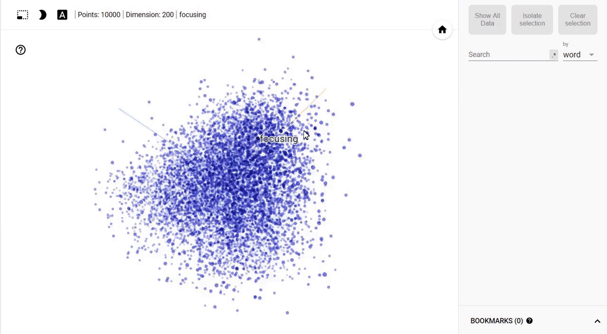

<!-- Main -->

<!-- One -->
<section id="one">
	

		<header class="major">
			<h1>Portfolio</h1>
		</header> 

<!-- Two -->
<section id="two" class="spotlights">
	<section>
		
		

			

				<header class="major">
					<h3>Product Status Dashboard</h3>
				</header>
				
Designed and developed the Product Status Dashboard at Citrix to display and monitor releases, features, security critical bugs etc across several teams at Citrix. One of the most useful features of the dashboard is its ability to report details on various levels of granularity, giving a comprehensive view of a team's and sub team's performances. Some of the key features include providing access for third party reporting tools like Powerbi and Tablaeu, an email notification system with embedded JQL tagging to schedule (and create templates for) emails with dynamic data and a fully customizable menu to tailor the look of the dashboard to the user's needs. The dashboard currently has ~1000 users.     
								<b>Tech used: C#, React, Ant Framework, MS SQL</b> 

				
			

		

	</section>
	<section>
		
		

			

				<header class="major">
					<h3>Automation Projects</h3>
				</header>
				
Wrote several Python scripts to automate creating and updating Confluence pages and Jira issues using their REST API. The scripts also update an Excel sheet using Openpyxl and Pandas. The scripts save multiple hours of manual work across several teams at Citrix to perform text analysis and generate informative reports about weekly releases. The scripts also perform validation of manual entries and if an error is detected, sends the user who last edited the document a detailed log of the errors. Automation of this task has saved the organization ~2 hours of manual work per product per week.
				 
				<b>Tech used: Python </b>
				 
				<b>Libraries and Frameworks used: BeautifulSoup, Openpyxl, Pandas, NumPy </b>
				

			

		

	</section>
	<section>
		
		

			

				<header class="major">
					<h3>Improving the Computational Efficiency of Deep Neural Networks using Filter Approximation Techniques</h3>
				</header>
				
Implemented a dynamic, input dependent filter approximation and selection technique to improve the computational efficiency of deep neural networks. The approximaation techniques convert 32 bit floating point filter weights in the convolutional and fully connected layers of the network into smaller precision values. This is done by reducing the number of bits used to represent the weights.  
				Since the goal of the approximation is to not reduce the classification accuracy, a metric called Multiplication Error was divised to calculate the per-input error between the precision filter weights and the approximated weights. The filter swap would take place based on the ME value to ensure high classification accuracy. The deep neural networks used for the project were AlexNet, LeNet and a 4-layered CNN. Datasets used were MNIST and CIFAR-10.		 	
				<b>Tech used: Python</b>

			

		

	</section>
	<section>
		
		

			

				<header class="major">
					<h3>16 Squares of Blacksburg</h3>
				</header>
				
Built an Augmented Reality App called 16 Squares of Blacksburg in C# and designed on Unity using Vuforia SDK to demonstrate the history of Blacksburg. Using 3D object models of 50+ buildings, the app was aimed to be an used as an educational tool where users could click on a building to get information about it along with a variety of interaction techniques like pinch to zoom, slide to rotate etc.  
				<b>Tech used: C#, Unity</b> 

				
<iframe width="560" height="315" src="https://www.youtube.com/embed/QxmlbWkX-e4" frameborder="0" allow="accelerometer; autoplay; encrypted-media; gyroscope; picture-in-picture" allowfullscreen></iframe>

				<ul class="actions">
					<li><a target="_blank" rel="noopener noreferrer" href="https://github.com/YaminiG/16-Squares" class="button">Learn more</a></li>
				</ul>
			

		

	</section>
	<section>
		
		

			

				<header class="major">
					<h3>Text Summarization using Deep Learning</h3>
				</header>
				
Performed abstractive text summarization on a Hurricane Irma dataset containing more than 16,000 documents. The dataset consisted of news articles, web articles and tweets. The goal of the project was to generate a manually written golden standard summary to compare the abstractive summary to and have the generated summary be as informative as possible. Some of the initial tasks included tweet and web page analysis followed by performing several text cleaning and boilerplate removal tasks such as custom stop word removal, lemmatization, tokenization and POS tagging using Python’s NLTK Toolkit. This was followed by text classification and document clustering for spam detection and sentiment analysis. Post data preprocessing, the text summarization was performed by using a deep learning model called the Pointer Generator Network using TensorFlow.  
 <b>Tech used: Python, Hadoop</b>

				<ul class="actions">
					<li><a target="_blank" rel="noopener noreferrer" href="https://github.com/YaminiG/Big-Data-Text-Summarization" class="button">Learn more</a></li>
				</ul>
			

		

	</section>
	<section>
		

